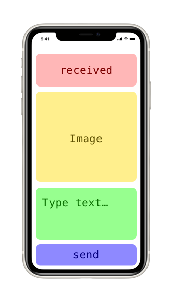

<p align="center">
	
</p>
<h2 align="center"> Idelfonso Gutierrez</h2>
<h3 align="center">👨🏻‍💻iOS Software Developer</h3>

From Venezuela 🇻🇪 in Chicago, IL 

- Spanish 🇪🇸 English 🇺🇸 speaker
- Let's go dance Cha-Cha, [Tango 🎻](#tango), Salsa, Swing
- _Recommended Books:_ 
  - BDD in Action
  - Combine, SwiftUI, Working With Legacy Code
  - Desgining Data-Intensive Applications
  - Vapor Framework 
  - A metabolic approach to cancer 📚... _a lot_

[Download PDF](resume_us.pdf) |

[Experience 👨🏻‍💻](#experience) | [Projects 🔬](#projects) | [Clients 🌾](#clients) | [Tech Stack 🛠](#tech-stack) | [Education 🎓](#education) | [Contact 📱](#contact-information) | 💾 [Save Contact as ...](idelfonso.vcf)


# Experience

#### `iOS Mobile Developer` [GrowIt!](http://growitmobile.com/) `Feb. 2018 - currently`
`▷ horticulture`
- In order to increase **40 percent** of the user base for our third-party clients, I implemented **beacon
technology**, **relational database**, and **mapbopx** library, which helped the company finalize 3 more contracts
- Use the **mobile instrumentation tool** to increase the efficiency of compilation time from 5 minutes to 2 minutes
and a half. Additionally, this help catch **data race conditions** between **Swift and Objective-C**
- Implement **Behavior Driven Development**, which is a document base layer for stakeholders to help
understand the situation, requirements, actions and results for every new and legacy feature.
- Automate the unit testing suite, app production submission, and quality assurance builds using continuous
integration and continuous deployment pipeline along with **Fastlane**.
- Help the community team decrease the amount of time reviewing inappropriate content by implementing
an image **machine learning** model based on a plant database to identify things that are not plants.
- **Solo developer** in the project

tools/frameworks/libraries:

- fastlane, circleCI, apple push notifications services, RealmDB, iBeacon, AutoLayout, Mapbox, ReactiveCocoa/Swift 🛠

#### `Technical Analyst iOS Mobile Developer` [Solstice Consulting](http://solstice.com/) `Sept 2017 - Feb 2018`
`▷ agriculture`
- Developing and maintaining ongoing project using unit testing frameworks, **AWS APIs** and **Protobuf**
- Communicate with clients in order to address concerns and drive feature between hardware and iPad App
- Deliver a presentation about machine learning intro which helped implement **image recognition** on a robot

tools/frameworks/libraries:

- Jenkins, MongoDB, WebSockets, AutoLayout, Protobuf, ReactiveCocoa/Swift 🛠

#### `Intern  iOS Mobile Developer` [YellowPepper](http://www.yellowpepper.com) `Nov 2016 - May 2017`
`▷ finnancial technology`
- Worked with multiple iOS **mobile banking apps** developed with Objective-C and third-party frameworks.
- Worked with an off-site team and product owner (different time zones) in order to address patch fixes.
- Addressed client’s concern regarding the app’s privacy policy in order to submit to App Store.

tools/frameworks/libraries:

- PCI APIs, Jenkins, AutoLayout, Objective-C, Alamofire 🛠

#### `Instructor CoderDojo Dec 2014 - May 2016`
`▷ education`
- Created stimulating lessons/games to an average of 20 students per session.
- Taught ongoing process and/or created new projects for beginners in a class of twenty students.
- Adapted sites like scratch.mit.edu and arduino.cc to motivate student’s creativity through technology.
- Coached public speaking at the end of each session so young ones can acquire the skills on how to structure their ideas.

#### `Programming Learning Assistant Florida International University Dec 2015 - May 2016`
`▷ education`
- Taught on an ongoing process and/or create new projects for college students using Java programming language in a class of twenty students
- Explained Object Oriented Programming concepts during in and out sessions
- Used pair programming with students in order to practice and review material

#### `IT Intern Developer Martin Digital Group Jan 2014 - April 2015`
`▷ online marketing`
- Strengthen relationship with the clients by integrating my technical experience and expertise.
- Fashioned a blog to look like a fitness site for moms and a subscription program.
- Checked logs and malfunctioning errors to avoid conflict with purchasing process on the website.
- Maintained the network, installation, and use of new software and process.

# Projects

### **`Writting BDD + TDD in my current projects`**

- **Who writes TDD?** tricky question🤔😅. Best case, its the output of a conversation between: devs, product owners/managers, stakeholders, and quality assurance testers
- **What is TDD?**  write software that assumes your production software is already built and make it compile/pass.
- **Why use TDD?** In order to avoid introducing bugs as you are adding or changing behavior.
- **When?** Drill down what you want your users to achieve _as concepts_ first _**[capabilities]**_
- **Where?** TextEdit! 📑 honestly!
- **How to?** Gherkin + Cucumber...ish + XCTest take a look [https://github.com/idelfonsog2/Cucumberish-UnitTest](https://github.com/idelfonsog2/Cucumberish-UnitTest) 👈🏽👀

Behavior driven development (BDD), Test driven development (TDD)

####  The Problem
A developer could write the following below. But this is missing some context, and only developers _**could!**_ be able to understand what is the system is doing.

<!-- not java, swift -->
```swift
func testSystem_whenReset_isInStarted() {
 sut.setToInProgress()

 sut.restart()

 XCTAssertEqual(sut.state, .blank)
}

```

#### A different approach

```gherkin
Given the application is "in progress"
When a user "restarts" the application
Then the application will set to "default"
```

```swift
func Given("the application is [regex]") { state in
 sut.set(state)
}

func When("a user [regex] the application") { action in
 sut.perform(action)
}

func Then("the application will set to [regex]") { expected in
 XCTAssertEqual(expected, sut.state)
}

```

The result out of it is that developers can make a set of reusable tests and stakeholders, product owners, QA tester can expand this tests into every state of the system.

Developers only need to keep following their TDD approach.

---

### **`Stranded`**

<!-- Follow: https://krausefx.com/ Pattern
  The Problem
  the Solution + images
  how it works + images
-->

#### _Background:_
_ORD_ 🛫 _MIA_ 🛬 _ETD 2:00 hr_

What's there to do at an airport besides waiting for your flight?

What about if we could meet someone?... Don't worry is not tinder

What's the ice breaker?

Math ➗ is international spoken, music 🎼 is international heard, body language too. A language_ 🗣 not so much 😕

🎺 + 💃🏻 + 🕺🏻 = social interaction

You don't need to talk when dancing Foxtrot, Salsa, Tango or Swing!

#### _The Solution: Coming soon_

🙂 Stranded brings people together at an international place (airport) in different time zones! 😲 Allowing them to socialize through dancing `<insert research paper here>`

<!--  -->

`h233f7343sh2sd chores: brief changes`

**tech:** Vapor Framework

---

### **`mmMapp`**

#### _Background:_
Have you ever had too many events in the same day at different times and different locations?

Were the events or appointments located close to each other?

Do you always take into consideration how long will it take you to go from appointment A to appointment B?

What about lunch? Do you have time to eat in the middle?

Or where you live? Chicago? Great city transit by the way! 5x_ ⭐️ _Miami?_ ☹️ _Sorry its an 1:40 min traffic along the I-95

**But most importantly!**
How happy or how stress are you? ⛱ 🤯

#### _The Solution: Coming soon_

<!--  -->

---

### **`Display vCard`**


#### _The Problem:_

_Do you have a business card? it probably has a cool design_ 📇

_They are useful when you need to leave in a rush_

_There is a individual in the middle, or "man in the middle"_

_manual work is prompt to error_

#### _The Solution:_

- _Update your information properly, inside the contacts app_
- [Install Shorcut](https://www.icloud.com/shortcuts/18cf866696df49e69c4e64bbf4a16e7a) 🛠
- _Select your contact card inside the shortcut "add contacts" step, it will show "me" on the right hand side of the list item_
- _Now everytime you have to leave in a rush have the person use the **built-in! camera app**_ 📲📷 _to scan your contact in one second_

_**Note:** also use "Share sheet" to send it using AirDrop, not too many users allow airdrop from everyone_

 

tech: Siri shortcut

---
### **`YellowPepper Talks`**



Introduction to Firebase Database, IAM, and backend for the front end developers.

 I talked about how to start with Firebase, Realtime Database, and its rules. Also about Storage Database and it rules

 Along with it, I developed a small sample iOS project using Swift to send text and image nodes, how they are shown in the firebase console, and which methods I use to retrieve them in the client

**tech:** Swift, UIKit, AutoLayout, Firebase Realtime DB

[GitHub](https://github.com/idelfonsog2/firebase_ios)

[Demo video](https://www.youtube.com/embed/tImGKXMNiMw)

---
### **`Hero World`**

Creating a test case for a new park for The Walt Disney company in order to track schedules and budgeting for the construction of all the projects.

Our dev team was able to implement a database using normalization, which helps identifies the identities inside the projects. We developed process of Table Creation, Views, Stored Procedures, Triggers. During the project we learned how an activity relates to a project, how a project can have many employees, and how a firm can own many employees. This is done using the concept of relational database.

**tech**: MySQL*

[GitHub](https://github.com/idelfonsog2/tumblr-app)

---

### **`Tubmlr Client`**

  

Created an iOS client in order to search blog users in Tumblr, follow users, and post text blogs.

**tech**: Tumblr API, UIKit

[GitHub](https://github.com/idelfonsog2/tumblr-app)

---
### **`On the Map`**

  

"On The Map" app allows users to share their location and a URL with their fellow students

**tech**: MapKit, Parse, Udacity API

[GitHub](https://github.com/idelfonsog2/udacity-on-the-map)

---

### **`Virtual Tourist`**

 

Wondering what kind of pictures have people taken in a particular place around the world?

Think about Virtual Tourist before Instagram search feature using Flicker

**tech** Flicker API, MapkKit, UIKit

[GitHub](https://www.idelfonso.com/)

# Clients

### **`Ally's Flower`**

  

Using Wordpress and Woocommerce was able to create a simple solution for a small business.

The owner was so glad that she didn't need the help of a tech savvy person and that it could easily integrate with the power of Square (POS)


**tech**: Wordpress, CRM, POS

[www.allysflower.com](www.allysflower.com)

### **`Proendoscopy`**

Created an iOS app to manage a database of items. Pros the effectiveness of adding a new item to the device database and reducing the time up to 97.5%.

Proendoscopy is a local company in the city of Sunrise, it specializes in the service and repair of medical equipment, mainly endoscopes.

Our dev team was able to quickly identify the main problem in their workflow and inefficiency of procedures in the sales department

**tech**: iOS: Objective-C, CoreData, UIKit


# Education

- Startup Cohort @FIU Jan 2017 - April 2017
- B.S. Software Developer Florida International University Aug 2012 - May 2016
  - Minor: Social Media and E-marketing Analytics
- iOS Nanodegree Udacity Sep 2016 - Nov 2016

# Tech stack

- machine learning on mobile: CoreML
- mobile software design patterns: coordinator, mvvm, mvc, mv?
- location: CoreLocation (MapKit), Google Maps, Mapbox
- dependency managers: Swift package manager, Cocoapods
- version control systems: Git, Github
- testing suites: XCTest, Cucumber
- Continuous integration and continuous delivery: fastlane, circleCI, Github Actions
- Bluetooth device integration: CoreBluetooth, Estimote Beacons
- functional reactive libraries: ReactiveCocoa/ReactiveSwift
- App Store release process
- database: CoreData, Realm
- cloud providers: heroku
- object Oriented programming languages: Swift, Objective-C
- network: RESTs apis, websockets

# *Contact Information*

📨 [idelfonsog2@gmail.com](mailto:idelfonsog2@gmail.com)

📞 [+1 954 513 9568](tel://+19545139568)

# Favorite talk

<blockquote class="twitter-tweet"><p lang="et" dir="ltr">que bueno 🤣🙌🏾 Actitud | Victor Küppers | TEDxAndorralaVella <a href="https://t.co/orerUgfhpo">https://t.co/orerUgfhpo</a> via <a href="https://twitter.com/YouTube?ref_src=twsrc%5Etfw">@YouTube</a></p>&mdash; Idelfonso (@idelfonsoGM) <a href="https://twitter.com/idelfonsoGM/status/1197903846305140738?ref_src=twsrc%5Etfw">November 22, 2019</a></blockquote> <script async src="https://platform.twitter.com/widgets.js" charset="utf-8"></script>

# Tango
Photograph by Charapin 🙌🏾


