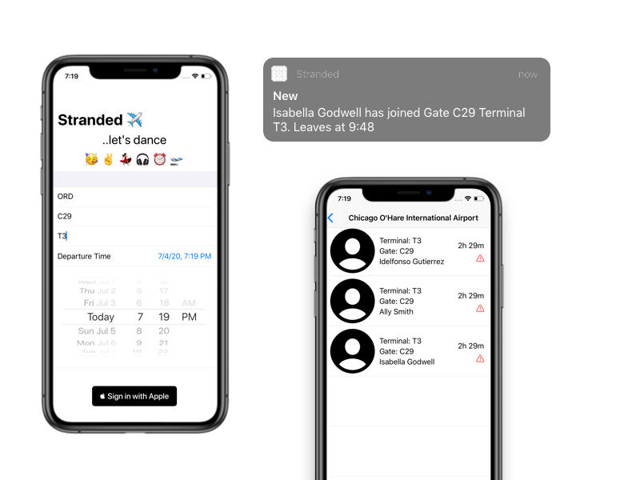
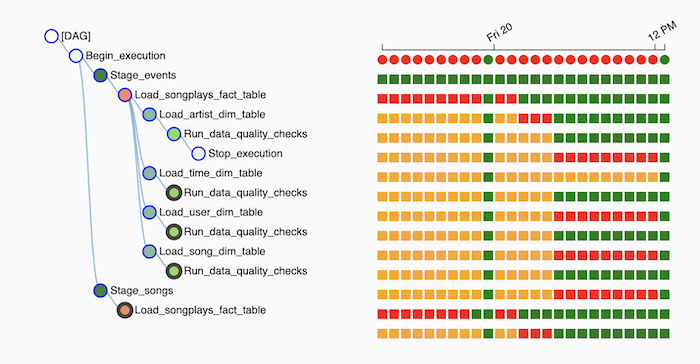
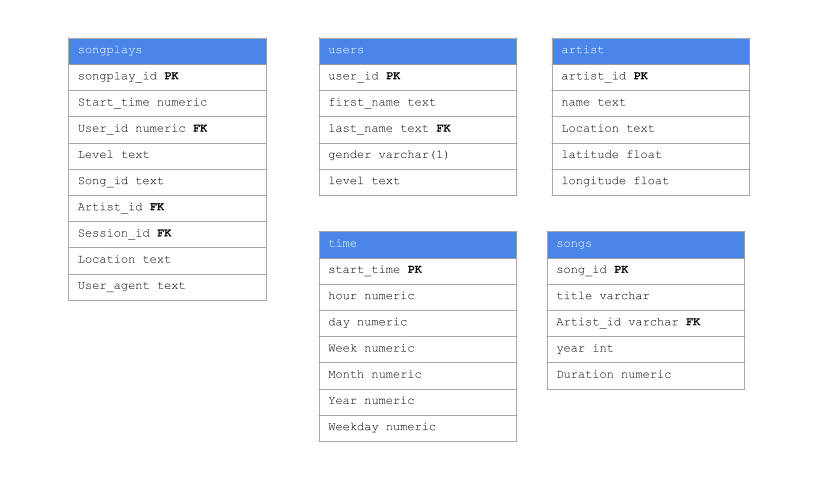

<meta property="og:title" content="Curiosity & continuous learning is an invaluable skill">
<meta property="og:description" content="Working with software applications and data pipelines.">
<meta property="og:image" content="https://idelfonsog2.github.io/img/circular-shot.png">

### **Featured App**

## `Stranded`



[](https://apps.apple.com/us/app/stranded-at-an-airport/id1522181739)

## **Dancing Tango at the airport 🍷**
<!-- ## **A trip. New connections. New Culture** -->

### **Enjoy your time at the airport as you dance with a another human before or after your flight.**

- It will map, filter, reduce common attributes of a person's trip 
- Take different time zones into account for everyones trips and reminders
- It will notify you when people are also waiting and they might enjoy a tanda.
- The rest is **HX**, human experience!


The project is inspired by my curiosity, passion for learning, [dancing](#current-about-me), meeting people, and this [community group](https://www.facebook.com/groups/348726108583892/)

*tech: [Swift](https:www.swift.org), [Vapor](https://vapor.codes), [Push Notifications](), [Database](), [Containers](Docker)*

---

<p align="center">
	
</p>

## Hola 👋

### Curiosity & continuous learning is an invaluable skill

I'm Idelfonso. I believe some things can be done much better and delightful.

The way I write `{code}` software applications is by making them much simpler, intuitive and user friendly.

Whether you are creating a proof of concept, need assitant on an ongoing or starting a new project – I can help! - <strong><a href="mailto:idelfonsog2@gmail.com?subject=I%20saw%20your%20site">send email</a></strong>
- 📜 [Articles](#articles)
- **Up** [Services](https://www.upwork.com/freelancers/~010e40ea91fa4fa610?viewMode=1)
  - [Mobile CI/CD ](https://www.upwork.com/services/product/the-ci-cd-that-your-mobile-team-doesn-t-know-it-needs-1465451061987807232?ref=fl_profile)
  - [Documenting products and features](https://www.upwork.com/services/product/documentation-files-about-the-requirements-of-your-project-1471520364424605696)
- 📱 [Work](#clients)
- 🐳 [Applications at Scale](#applications-at-scale)
- ☁️ [AWS Projects](#aws-projects)
- 🕺 [About Me](#about-me)
- 💾 [PDF version](resources/resume_us.pdf)
- **@** [idelfonsoGM](https://twitter.com/idelfonsogm)
<!-- - 💾 [Contact Card](idelfonso.vcf) -->

--- 

## Open Source Contributions

### Documenting software products and writting tests for them (TDD + BDD)

**Github Repo** [Cucumberish - Ahmed-Ali](https://cucumber.io/docs/installation/ios/) 👈🏽👀

- **Who writes the User Stories?** tricky question. Best case, its the output of a conversation between: devs, product owners/managers, stakeholders, and quality assurance testers
- **How to write them ?** There is a format for that! [Gherkin!](https://cucumber.io/docs/gherkin/)
- **What is it?**  Specification document + automation test scritps
- **Why do it?** 
  1. ⭐️ It gets you the definition of DONE. *In case your client is not product driven, it gets them to help you define what do they really want from the product!*
  2. ⭐️ Automate regressiong testing. *Don't break backwards compatible funcitonality*
  3. ⭐️ Brings labor and cost efficiency approaches. *Do not repeat yoruself*
  4. ⭐️ Documentation. *if you are onboarding as a new developer, this will help you a lot!*
- **How to implement it ?** 
  - [Programming libraries](https://cucumber.io/docs/installation/)
  - [Behavior Driven Development Book](https://www.manning.com/books/bdd-in-action)

> ### No method is more effective than a good example. - Ingvar Kamprad, IKEA Founder

####  The Problem
A developer could write the following below. But this is missing some context, and only developers _**could!**_ be able to understand what is the system is doing.

<!-- not java, swift -->
```swift
func testSystem_whenReset_isInStarted() {
 sut.setToInProgress()

 sut.restart()

 XCTAssertEqual(sut.state, .blank)
}

```

#### A different approach: Give me an example

```gherkin
Given the application is "in progress"
When a user "restarts" the application
Then the application will set to "default"
```

```swift
func Given("the application is [regex]") { state in
 sut.set(state)
}

func When("a user [regex] the application") { action in
 sut.perform(action)
}

func Then("the application will set to [regex]") { expected in
 XCTAssertEqual(expected, sut.state)
}

```

The result out of it is that developers can make a set of reusable tests and stakeholders, product owners, QA tester can expand the tests into every state of the system.

Developers only need to keep following their TDD approach.

Are you interesting in implementing the above? Take a look at this service in [Upwork](https://www.upwork.com/services/product/documentation-files-about-the-requirements-of-your-project-1471520364424605696)

---

## Articles

### **Programming with Swift Distributed Actors 🎭**

I just completed [reading the proposals](https://github.com/apple/swift-evolution/tree/main/proposals), [watching the talks](https://developer.apple.com/news/?id=2o3euotz), and reading the book [(Modern Swift Concurrency)](https://www.raywenderlich.com/books/modern-concurrency-in-swift/v1.0) and this feature has less than 2 months old. The concept and implementations has been around for a bit.

But what does it really do?

> TL;IR

It helps to reason what code you are writting, forget about where is been executed, and helps avoid data races.

`Thread Safe` code is the one you can call from other threads without having to worry about two functions invoking that memory location at the same time.

We no longer have to rely on the **hope and pray method** of the Third-party SDKs documentation for this vital piece of information and the develoepers spending days if no weeks debugging the `init` method of the SDK.

"..not to worry about where is been executed?"  

You must read/watch: 
- [Introducing Swift Distributed Actors](https://www.swift.org/blog/distributed-actors/)
- [Konrad releasing Swift Distributed Actors](https://www.youtube.com/embed/7yu6mEq8R2Q)
- [Tim Condon using Distributed Tracing in production with Swift](https://www.youtube.com/watch?v=Z2hfW06eyk0&t=958s)

**NOTE:** All these readings, side projects, and continuous training is part of my ongoing learning of server-side swift development.

---

### **DevOps: Even mobile applications should have YAML & `basch` from the start**

Scripts basically. Scripts help you do the following things:

- CI/CD pipeline
- automation of certificate management
- build configuration files

The above is no longer a topic of discussion... **It's a prerequisite**.

- We don't need it at the moment, we can do it manually
- Isn't too much? it's a single app
- We can do all the testing in one environment

> **Disclaimer** If you or your team is already working or starting a software application project then I'm assuming it's a serious project. Otherwise, I'm assuming you are testing a new API and the application does not generate any revenue or cuts down on cost in any way.

Once a team has build a product and structure a process around it, like in: release, testing, or debugging; the next phase is to bring automation. Not just business logic code can affect your app but also the bad use of misconfiguration will impact it the most. The previous is encapsoluted by a CI/CD pipeline.

Another way to look at it is: current changes are based on time window, if there are more changes to integrate, that time window will grow. In some cases exponantionally [O(n^2)] Test that run efficiently can bring confidence and assurance of a new release.

Tips + Benefits:

- Adopt current agile practices; configuration file reviews can avoid detecting issues in config files
- automation process; it helps reduce human error in resource provisioning and esure consistent deployments
- Secrets Management; manage connection strings, keys, secrets, and certificates within tools provided by the CI system and manage them per environment
- Access Control; you get the benefit by using manage identities or service accounts to automate resource provisioning
- Avoid configuration drift; inconsitent deployments

The pipeline is so important in mobile that even Apple created one, [XCode Cloud](https://developer.apple.com/xcode-cloud/) 👩‍💻 ☁️

> ### Any CI/CD is better than no CI/CD - [StackOverflow](https://stackoverflow.blog/2021/12/20/fulfilling-the-promise-of-ci-cd/)

Profiles, certificates, and tokens are interchangeable terms, but they are very different. I will refer to them as certs. The team will benefit from having the same downloading the same certs. Otherwise, everybody is creating confusion and not being organize enough. A tip to prevent the previous, use [fastlane](https://docs.fastlane.tools/actions/match/#match) 🚇 Teams at many companies including Google are using it.

*Extra* **DevOps** is and is not: a methodology, a single piece of a software tool, a specific role/task.

> ### ... You can fix the problem at the source, by focusing relentlessly on the length of time between when a line of code is written and when it is fully deployed to production ...- [stackoverflow Fullfillng  the promise of CICD](https://stackoverflow.blog/2021/12/20/fulfilling-the-promise-of-ci-cd/)

---

### **Bridging `completionHandler(_:)` and `async/await`**

If you have been reading or watching the Swift Evelution proposals you might have barely heard about `continuations`.
Continuations lets you capture in a closure (in some cases) the result of a delegate callback and return it to be use as a suspension point after you have explictly requested for the value of that object.

There are many different ways to implement continuations. In the next example, I show you how I converted `ASAuthorizationControllerDelegate` "custom" object to be use as an asynchronous function

```swift
class SignInWithAppleService: NSObject, ASAuthorizationControllerDelegate {
  //...
  public func fetchAppleIDCredentials() async throws -> ASAuthorizationAppleIDCredential {
          let request = ASAuthorizationAppleIDProvider().createRequest()
          // ...
          return try await withCheckedThrowingContinuation { continuation in
              self.activeContinuation = continuation
              controller.performRequests()
          }
    }
}

// MARK: - Use
let signInWithAppleService = SignInWithAppleService()
let credentials = try await signInWithAppleService.fetchAppleIDCredentials()
```

I left many details out, but it's with the hope to make it an excersice for your the reader. There are still many Apple APIs which were left out of the convertion batch, just like the above. You will find many methods with the new and old API declaration in your autocomplete window. 

---

### **Writting software asynchronously 🧵**

With my ongoing project feature at the [top](#featured-app) I have been able to gather all the knowledge I gained into a single application... more like many related to the same application.

I'm really grateful and content about the excitement there is in the [#SwiftLang](https://twitter.com/search?q=%23SwiftLang) community. Many people think _You write iPhone applications_ - __maybe!__ I can relate to this conversation [Twitter video](https://twitter.com/davejacobseniOS/status/1453743066137907204)

[Swift](https://www.swift.org) is an open-source language which has achieve things like [differential progamming](https://en.wikipedia.org/wiki/Differentiable_programming), [functional programming](https://en.wikipedia.org/wiki/Functional_programming), and [**server-side development**](https://vapor.code). Within the last 2 weeks ago! 🤯, the language gain two new milestones [**Concurrent programming**](https://docs.swift.org/swift-book/LanguageGuide/Concurrency.html) and [**Distributed Computing**](https://www.swift.org/blog/distributed-actors). Amazing 🚀.

For my project, I have been able to combine and use server-side development, concurrent programming and leverage the use of declarative programming. These were things that I was looking at the progress of, mainly thanks to the [Swift Evolution](https://github.com/apple/swift-evolution) [#iOSApp](https://apps.apple.com/us/app/evolution-app/id1210898168).

<!-- I'm not only writing the mobile front end and the backend with the above as I mentioned. I'm also working with another recent feature announced [Swift AWS Lambda](https://github.com/awslabs/aws-sdk-swift),  -->

At this point you might wonder:
- _Maybe is overkill? Do you pretend to add everything that you find? When would I ship it?_ 

> The true is... I enjoy learning, doing, and improving

---

### **AWS Lambda with Swift Runtime**

Many iOS developers don't realize at the beginning that they are actually using a programming language with Functional Paradigm and Principles.

The Swift language became really popular thanks to iOS applications. Today, the language does not only help builds applications across an array of customer-facing hardware (iOS, WatchOS, iPadOS, CarPlay) but also enterprise-level and research level as of backend applications and machine learning models respectively.

Most recently I saw a microcontroller dev kit for people to start building projects that exist with Raspberry Pi but with Swift and it's own IDE []()

> # "a prototype is worth 1000 meetings" - IDEO

Many people say: "well.... its just a Hello World program" or "it lacks the vote from an enterprise point of view" To them I must say there is not an official council who approves or disapproves what technology lives up to the standards. 

Newer technologies aim to address the issues and lack of current technology, how far we can push it, it's only up to us

- [Use Swift on AWS Lambda with Xcode](https://developer.apple.com/wwdc20/10644)

- [AWS Full Stack Swift with Apple CarPlay](https://github.com/aws-samples/aws-serverless-fullstack-swift-apple-carplay-example#readme)

- [Getting started with Swift on AWS Lambda](https://fabianfett.de/getting-started-with-swift-aws-lambda-runtime) - [Fabbian Fett](https://twitter.com/fabianfett)

---

### `iOS install certs`

If we are in 2021 and the team does not have the following... you are crippling the product and the developers. Not too many people think is important. The budget will reflect it and because is not important it will be hard for stakeholders to pinpoint the money leak. At the moment there is not a good debugging tool for it... I'm looking at you JIRA 👀

The command line is more like `$ fastlane ios_install_certs` Many people would know the previous. For the rest who have left this process manual and up to all team members to figure out, let me explain:

Nobody has to be granted access to the Apple developer portal. Otherwise, the admin**s** has to manage new people and people who are no longer working on the project. But then what's behind the curtain? Git. Because you have previously set up the above in place developers only have to copy the up to date certs from the source control vendor they already using and have access to.

If you are even a single/solo/indie/freelancer app developer for Apple operating systems you (or the rest of the team) will help the client save money. For the developer, s/he can stop wondering if the job they are doing is worth it.

---

### `YellowPepper Talks`

[](http://www.youtube.com/watch?v=tImGKXMNiMw)

Introduction to Firebase Database, IAM, and backend for the front end developers.

 I talked about how to start with Firebase, Realtime Database, and its rules. Also about Storage Database and it rules

 Along with it, I developed a small sample iOS project using Swift to send text and image nodes, how they are shown in the firebase console, and which methods I use to retrieve them in the client

**tech:** Swift, UIKit, AutoLayout, Firebase Realtime DB

[GitHub](https://github.com/idelfonsog2/firebase_ios)

---

# Side projects

  - [Data Pipelines with Apache Airflow](#data-pipelines-with-apache-airflow) Use Airflow to backfill and schedule the load and analysis of raw data into Redshift data warehouse 
  - [Data Lake with Apache Spark](#data-lakes---with-apache-spark--emr-cluster) Use Spark, Schema-On-Read, and EMR to create an ELT* process
  - [Data Warehouse with AWS S3, Redshift](#data-ware-with-aws-redshift) Create an ETL process to insert OLAP cubes in amazon  redshift
  - [Big Data modeling with Apache Cassandra](#creating-an-etl-process-with-apache-cassandra) Use the partitioned row store for a distributed system. To analyze, clean and aggregate data.
  - [Enterprise data modeling with PostgreSQL](#data-modeling-with-postgresql) Normalize a dataset in order for online analytical processes

### `iOS/macOS Shortcuts`

- [Electronic Business Cards Shortcut](https://www.icloud.com/shortcuts/18cf866696df49e69c4e64bbf4a16e7a) 🛠

---

# Applications at Scale

## Monoliths vs Microservices - Docker 🐳 + Kubernetes ⚙️

- Monoliths are the best IF your audience is small
- Microservices are the best IF your audience is large

> ### So whats in between 😅 ? ... Just pros and cos like anything else

Some of the things that a backend application needs are:

- runtimes
- metrics and logs
- networking
- tracing
- storage

> ### How do you make this transition??? Gradually! Put your Monolith as a microservice and start 📦ing

### Level: 1

When thinking about a monolithic application we can think of applying the above to a single machine and hey it can be fun and bery granular.

Careful now, you don't want to have business logic in these configurations.

### Level: 2

Now you are applications fronent/backend has been running for a couple of months by now and you were finally able to focus on your marketing strategies. You even sign-off with a partner that attracted a couple thousand of users from their private event.

### Final Level: Startup Life

Now your application is giving 500 error cause you only allocated 1 GB to your server; many users tried to sign up at the same time. This goes on for a couple of days. Welcome to the startup life

- Application Packaging with Docker
- Container Orchestration with Kubernetes
- Kubernetes Resources
- Declarative Kubernetes Manifests

---

# AWS Projects

## Data Pipelines with Apache Airflow

When data analysts and data scientists use data, they rely that is accurate and diverse enough in order to come up with these amazing models that help drive business decisions. Data comes from many places and from different times; a system could start collecting data tomorrow or it was already started 20 years ago; Imagine that 😅

### DAG

This project showcases how to design and schedule a series of jobs/steps using [Apache Airflow](https://airflow.apache.org/) with the following purposes
- Backfill data
- Build a dimensional data model using python
- load data from AWS S3 bucket to AWS Redshift Datawarehouse
- run quality checks on the data
- Use or create custom operators and available hooks to create reusable code



[Github](https://github.com/idelfonsog2/data-schedu
ler-airflow)
This project was completed under the Data Engineer Udacity Nanodegree [link](https://www.udacity.com/course/data-engineer-nanodegree--nd027)

**tech:** AWS Redshift, Python, Apache Airflow, Docker

***
## Data Lakes 🚤  with Apache Spark + EMR Cluster

You can take a trip to a polluted lake or a clean lake and how the water looks, tastes, or where it comes from matters.

Data lakes is a new analogy to what Data Warehouse was till not too long ago. We are still using the same hardware for Data lakes, but with new tools which makes possible to cover more ground. 

In my previous project [STAR vs 3NF 🥊 SCHEMA](#STAR-vs-3NF-🥊-SCHEMA) I prepared the data to be ready for use by BI applications with the **OLAP cubes**. It's a structure that has been validated and vetted through several implementations and successful cases. When I learned about **Data lakes**: the tools, the language, Serverless (Python, learning Scala) I felt that I save a bit of automation by looking into it. 

Don't get me wrong, like any other technology it's flexible, there are pros and cons, budget, analysis of your workload, and team work.

>  Data is the new oil 🛢 

As I mention, automation, but not really. Instead of creating tables and doing the ETL dance, lets do the **ELT** 💃 dance.

Big Data frameworks like Spark focuses on what, where, and how to what Hadoop couldn't

- What *type* of files you read/write has more variety
- Where the files *reside*; filesystem or databases
- How everything becomes available through `DataFrames` + `SQL`

```python
df = spark.read.csv('s3a://.../file.csv', sep=';', inferSchema=True, header=True)
df.createTempView("log_data")
user_table = df.spark.sql("""
                        SELECT user_id as id', 'year(ts) as year
                        FROM log_data
                        """)
user_table.show(1)
user_table.write.parquet('users', partittionBy='year')
```

[Jupyter Notebook](resources/data_lake.md)

We will perform our transformation and have them save in **S3** for which our BI apps could connect to or we could attached to the **cluster**, but they are expensive 💰. S3 it's cheap and it doesn't get shutdown.

Another step is the **Schema-on-read** for this process to be possible, and if you noticed there is a lot of steps.

[Github](https://github.com/idelfonsog2/spark-music-data-pipeline)

This project was completed under the Data Engineer Udacity Nanodegree [link](https://www.udacity.com/course/data-engineer-nanodegree--nd027)

**tech:** AWS EMR (Spark+HDFS), Python, Notebooks

---

## Data Warehouse with AWS Redshift

> Why would we want to use re-create our table structures for Analytical Procedures?

It happens that performance is much better, we can do fewer joins and access the same information. We still would like to have our 3NF schema for application purposes on the side, think about it like a separate microservice. Besides re-creating our tables, these can be improve... by a lot more with the following!

- Non-Columnar Storage (AWS REDSHIFT)
- Distribution table Style (All, even, key), 
- Distribution Keys 🔑

In the first point, I'm talking about creating an ETL process to load this data, but of course there is some setup that needs to be done

> ### _There is an overcrossing between Infra DevOps 🛠 and Data Engineers 💾_

For this project I utilize AWS web services like `redshift`, `s3 storage buckets`, `user roles`, `policies`, and `cloud watch`

The idea is how can we prepare data to be use by _Business Intelligence_ applications Tableu or even Jupyternotebook! 👍
In order to help the business see an overview of the data in a diagram of what important features of the product their customers might be using. Mainly, how can we improve the performance of these OLAP and OLTP transactions? For that, we use the combination of star schema tables, we build a strategy for a distributed data system, and do grouping for all the features thanks to REDSHIFT.


[Jupyter Notebook](resources/data_warehouse.md)

This project was completed under the Data Engineer Udacity Nanodegree [link](https://www.udacity.com/course/data-engineer-nanodegree--nd027)

**tech:** AWS services*, Python, Jupyter

---

## Creating an ETL process with Apache Cassandra

### _Handling BIG DATA and storage now a days is no just feasible, it's a must._

```python
import pandas
import cassandra
``` 

Losing customer it's not an option. Today in the world we have a ton of devices that are gathering and sending data. The benefit of using a document store database #NoSQL, is that developers don't need to maintain and/or adjust entities, migrations and changes on existing products. Companies and product moves in an agile environment, where requirements are constantly changing; NoSQL allows us to spin these requirements in a quick manner.

#### The Business Case 💼

The following application establishes the following case where we have deploy a music app and its collecting data which it's the store to a local text file. From that we known which songs does the user listens to and which membership they are on (at a higher level).

```swift
// "Some of the largest production deployments include Apple's, with over 75,000 nodes storing over 10 PB of data, Netflix (2,500 nodes, 420 TB, over 1 trillion requests per day), Chinese search engine Easou (270 nodes, 300 TB, over 800 million requests per day), and eBay (over 100 nodes, 250 TB)." https://cassandra.apache.org/
```
My job was to extract transform and load this data into the system where business teams could bring their requirements and collect solutions from the data.

[🔗 Jupyter Notebook ETL Process](notebooks/cassandra-etl-pipeline.html)


[Github](https://github.com/idelfonsog2/cassandra-etl-pipeline)

**tech:** Apache Cassandra, Python, Pandas

This project was completed under the Data Engineer Udacity Nanodegree [link](https://www.udacity.com/course/data-engineer-nanodegree--nd027)

---
## Data Modeling with PostgreSQL

```python
cur.execute("DROP DATABASE IF EXISTS ...")
```

Executing the basic CRUD commands is nothing new when it comes to building a system. A well-thought system it's very agnostic, and concepts are transferable within different lower level products. Some of the most popular RDBMS involve PostgreSQL, OracleSQL, MySQL. But where does the data comes from? How often does the data change? How many files do we have, and how often we get new ones? Can we blame IoT 🛰 devices? 
> To the infinity and beyond... - Buzz Lightyear 1995

In the following application are given directory paths of where the client-side system is storing data files based on a music application product. I analyzed the data, build its entities and form the basic link between them. The analytics team is particularly interested in understanding what songs users are listening to



[Github](https://github.com/idelfonsog2/pslq-data-modeling)

This project was completed under the Data Engineer Udacity Nanodegree [link](https://www.udacity.com/course/data-engineer-nanodegree--nd027)

**tech:** PostgreSQL, Python, Pandas

---
### **`Hero World`**

Creating a test case for a new park for The Walt Disney Company in order to track schedules and budgeting for the construction of all the projects.

Our dev team was able to implement a database using normalization, which helps identifies the identities inside the projects. We developed a process of Table Creation, Views, Stored Procedures, Triggers. During the project we learned how the activity relates to a project, how a project can have many employees, and how a firm can own many employees. This is done using the concept of a relational database.

**tech**: MySQL*

[GitHub](https://github.com/idelfonsog2/HeroWorld-SQL)

--- 
# Clients

## **Ally's Flower 💐**

It is an online delivery flower shop located in South Florida, servicing the area of Orlando mostly.

### *Roadmap*

- (stage 1) A website to showcase products
- (stage 2) Manage leads and customer information
- (stage 3) Accept payments and order forms
  - (stage 3.5) limit the range of delivery

### *Communication*

I had initial conversations with the client in order to sense her priorities, budget, and timelines. I happen to bump into a cheerful person who is very creative, organized, and skillful. She had everything on paper and folders. As a matter of fact, she was doing all the floral arrangements from her kitchen and in the living room she had the photo studio setup

### *Implementation*

At the time and the lack of platforms available, I went to help her build her online retail shop using wordpress based on the functionality of uploading the floral photos and purchasing a third party theme.

### *Follow-up*

After a few months, the client reached back again. She wanted to start accepting payments and delivery forms, also for a way to collect customers information. Most of the work was advice and setup.

Knowing there are many platforms out there dedicated for retailing, easy to build, payment integration, and most importantly, a solid foundation. I recommended her *Squareup*

We went ahead and moved the website domain and started filling up the business requirements. After basic training and follow-up calls, the client is happier than ever that she can continue doing business and not having to worry about workplace and retail location.

### *Deliverable*

[www.allysflower.com](www.allysflower.com)

--- 

### **Proendoscopy 💉**

Proendoscopy is a local company in the city of Sunrise, it specializes in the service and repair of medical equipment, mainly endoscopes.

Inventory management iOS application:
- Keep latest status of items when they were sold, currently in repair, or backlog.
- Keep a record of all the items features
- Filter and sorting of items by brand, category, price range
- Image uploads for the item

**tech**: iOS: Objective-C, CoreData, UIKit

[www.proendoscopy.com](www.proendoscopy.com)

---

# Employers 


### iOS Software Developer | [Northwestern Medicine](https://www.nm.org/) | Chicago, U.S. | Current

---


### Enterprise iOS Software Developer | [Ulta Beauty](https://www.ulta.com/) | Chicago, U.S.

- Work with mobile device management solution to assist managed devices and managed applications
- Develop backend and frontend applications that improved associates processes
- Write automation scripts and continuous integration pipelines to address multiple applications and the collaboration of team members
- Minimize initial technical debt by introducing test-driven development and working with the UX/UI in order to guide them when using the Apple platforms.
- Leading story reviews with business stakeholders
- Minimize technical support feedback loop and hardware issues by integrating the IT support system and hardware's SDK for troubleshooting.
- Develop new applications which include flows, features, and hotfixes utilizing the repository, injection, and modularizing patterns.
- Diagram end-to-end architecture and evaluate technical decisions as to the project progress
- Build internal and external business partners relationships to clarify concerns and discuss possible approaches to current and upcoming projects
- Work on legacy projects in order to maintain backward compatibility for new features
- Assisting in developing hybrid applications projects
- Continuous communication with the product manager, product owner about the project's progress

---


### iOS Software Developer | [GrowIt!](http://growitmobile.com/) | Chicago, U.S.

- Able to lock in 3 customer agreements signups when finalizing our data product. This involved **beacon
technology**, **relational database**, and map data visualization (Mapbopx).
- Through the use of **Apple push notification system** we created an analytics product for our third-party associates that help them oversee returning customers
- Use the **mobile instrumentation tool** to increase the efficiency of compilation time from 5 minutes to 2 minutes
and a half. Additionally, this help catch **data race conditions** between **Swift and Objective-C**
- Implement **Behavior Driven Development**, which is a document base layer for stakeholders to help
understand the situation, requirements, actions and results for every new and legacy feature.
- Automate the unit testing suite, app production submission, and quality assurance builds using continuous
integration and continuous deployment pipeline along with **Fastlane**.
- Help the community team decrease the amount of time reviewing inappropriate content by implementing
an image **machine learning** model based on a plant database to identify things that are not plants.
- **Solo developer** in the project
- Developer's **time is valuable**. As a result, created CI/CD software pipelines to facilitate gradual deployment, automated tests, rollbacks, and feature flags
- Delivered features in the most feasible ways using **refactoring design patterns**
- Find balance and knowledge between the technical vision and the delivery of products when gathering and delivering stakeholders requirements

### tools/frameworks/libraries:

- Fastlane, Circle CI, apple push notifications services, XCUITest, iOS dependency managers(Swift Package Manager, git sub-modules, cocoapods) RealmDB, iBeacon, AutoLayout, Mapbox, ReactiveCocoa/Swift 🛠

Tags: horticulture

---


### iOS Software Developer | [KIN+KARTA](http://kindandkarta.com/)

- Deliver a total cost reduction of -$10,000.00 by integrating an iPadOS app with IoT devices
- iPadOS app with commands and realtime data visualization analytics to/from IoT devices
- Small talk about machine learning use cases and example with **Apple CoreML Framework**

### tools/frameworks/libraries:
- Jenkins, MongoDB, WebSockets, Protobuf, UI reactive library 🛠

tags: agriculture

---

# Education

- B.S. Software Developer Florida International University Aug 2012 - May 2016
  - Minor: Social Media and E-marketing Analytics
- @StartupFIU Small Startup Incubator
- reTraining:
  - Cloud Native Application Architecture Nanodegree Program Udacity
  - Data Streaming Nanodegree Program Udacity
  - Data Engineer Nanodegree Program Udacity
  - Mobile Device Management (MDM) Workspace One Unified Certification by VMWare
  - iOS Nanodegree Program Udacity

--- 
### `mmMap 🚎` @StartupFIU

**The Problem**

- Have you ever had too many events in the same day at different times and different locations?
- Were the events or appointments located close to each other?
- Do you always take into consideration how long will it take you to go from appointment A to appointment B?
- What about lunch? Do you have time to eat in the middle?
- Or where you live? Chicago? Great city transit by the way! 5x_ ⭐️ _Miami?_ ☹️ _Sorry its 1:40 min traffic along the I-95

**But most importantly!**
How happy... or how stress are you? ⛱ 🤯

> The ability to keep learning is an invaluable skill

**The Solution**

`mmMapp` link your calendar with your social media accounts and have mmMapp shows you the events in a sequence with stopping points, happy routes to take, human experience taking int consideration. 

---


### Intern  iOS Software Developer | [YellowPepper](http://www.yellowpepper.com) | Miami, U.S. | Nov 2016 - May 2017

- Worked with multiple iOS **mobile banking apps** developed with Objective-C and third-party frameworks.
- Worked on production-bugs in collaboration with DevOps and Quality Assurance teams
- Run small proof of concept features in order to validate the demand


### tools/frameworks/libraries:

- PCI APIs, Jenkins, AutoLayout, Objective-C, Alamofire 🛠

tags: financial technology

***

### Coding Mentor | Volunteering | [CoderDojo](https://coderdojo.com/) | Miami, U.S. | Dec 2014 - May 2016

CoderDojo is a non-profit organization aimed to teach introductory coding-skills concepts through hands-on learning for students between 4th grade and 8th grade.

As a mentor, I had a transformative experience by being able to teach and spark joy among the students.

Lessons objectives included working with **scratch.mit.edu** in order to demonstrate the following: 
- iterative loops
- conditional statements
- value assignment 
- functions
- object-oriented programming / classes
- Hardware programming using Arduino boards

Additionally, students are encourage to:
- Expose creativity
- Working with other classmates
- Showcase their achievements
- Ask questions

***

### IT Intern Developer | [Martin Digital Group](https://www.martindigitalgroup.com/) | Miami, U.S. | Jan 2014 - April 2015`

- Strengthen relationships with the clients by integrating my technical experience and expertise.
- Fashioned a blog to look like a fitness site for moms and a subscription program.
- Checked logs and malfunctioning errors to avoid conflict with a purchasing process on the website.
- Maintained the network, installation, and use of new software and process.

Tags: online marketing

*** 
### Java II Learning Assistant | [Florida International University CIS Department](https://www.cis.fiu.edu/) | Miami, U.S. | Dec 2015 - May 2016

- Taught on an ongoing process and/or create new projects for college students using Java programming language in a class of twenty students
- Explained Object Oriented Programming concepts during in and out sessions
- Used pair programming with students in order to practice and review material

tags: education

---

# About me

## Recommended readings

- [Domain Driven-Design](https://www.amazon.com/gp/product/0321125215?ie=UTF8&tag=martinfowlerc-20&linkCode=as2&camp=1789&creative=9325&creativeASIN=0321125215)
- [Working With Legacy Code](https://www.amazon.com/Working-Effectively-Legacy-Michael-Feathers/dp/0131177052)
- [Designing Data-Intensive Applications](https://www.amazon.com/Designing-Data-Intensive-Applications-Reliable-Maintainable/dp/1449373321/ref=sr_1_1?crid=393J1ET1HBZB8&dchild=1&keywords=designing+data+intensive+applications&qid=1601994325&s=books&sprefix=designing+data+i%2Cstripbooks%2C162&sr=1-1)
- [Functional Programming - with Swift](https://www.objc.io/books/functional-swift/) 
- [Behavior Driven Development in Action](https://www.amazon.com/BDD-Action-Behavior-driven-development-lifecycle/dp/161729165X/ref=sr_1_1?crid=1QMU5POSX4VUP&dchild=1&keywords=behavior+driven+development&qid=1601994363&s=books&sprefix=behavior+Driven+Deve%2Cstripbooks%2C167&sr=1-1)
- [Server-Side Swift](https://www.google.com/search?client=safari&rls=en&q=vapor.code&ie=UTF-8&oe=UTF-8)
- [A metabolic approach to cancer 📚](https://www.amazon.com/Metabolic-Approach-Cancer-Integrating-Bio-Individualized/dp/1603586865/ref=sr_1_2?crid=K25WDL26D9QF&dchild=1&keywords=a+metabolic+approach+to+cancer&qid=1601994411&sprefix=a+metabolic%2Cstripbooks%2C158&sr=8-2)
- [Geopolitics](https://www.amazon.com/Next-100-Years-Forecast-Century-ebook/dp/B001NLL946/ref=sr_1_1?crid=2DE719JVUJ0NJ&dchild=1&keywords=the+next+100+years+george+friedman&qid=1601994579&sprefix=the+next+100%2Caps%2C160&sr=8-1)
- Urban planning
- [How to Think for yourself](http://paulgraham.com/think.html)
- [Why Books Don't Work](https://andymatuschak.org/books/)
- [Quantum Country](https://quantum.country)

## Lección para tu vida

<blockquote class="twitter-tweet"><p lang="et" dir="ltr">que bueno 🤣🙌🏾 Actitud | Victor Küppers | TEDxAndorralaVella <a href="https://t.co/orerUgfhpo">https://t.co/orerUgfhpo</a> via <a href="https://twitter.com/YouTube?ref_src=twsrc%5Etfw">@YouTube</a></p>&mdash; Idelfonso (@idelfonsoGM) <a href="https://twitter.com/idelfonsoGM/status/1197903846305140738?ref_src=twsrc%5Etfw">November 22, 2019</a></blockquote> <script async src="https://platform.twitter.com/widgets.js" charset="utf-8"></script>

---

> From Venezuela 🇻🇪 bailando 🕺


Photograph by Charapin 🙌🏾

2021, Github Pages
