<!-- # ---
# Feel free to add content and custom Front Matter to this file.
# To modify the layout, see https://jekyllrb.com/docs/themes/#overriding-theme-defaults

#layout: home
#--- -->
# Idelfonso Gutierrez

**iOS Developer from Venezuela 🇻🇪**  currently in Chicago, IL [@GrowIt]()

`$ someone who creates computer software`

- Let's go dance 🕺🏻 tango, salsa, or swing.
- _Reading_ Apple documentation, Combine, Vapor Framework 📄
- _Best dishes_ Indian Paneere, Italian Cannolies, Chimichurri, Tequeños de Venezuela 🤤

[Projects](#projects) | [Experience](#experience) | [Clients](#clients) | [Education](#education) | [Contact](#contact-information)

# Projects
<!-- 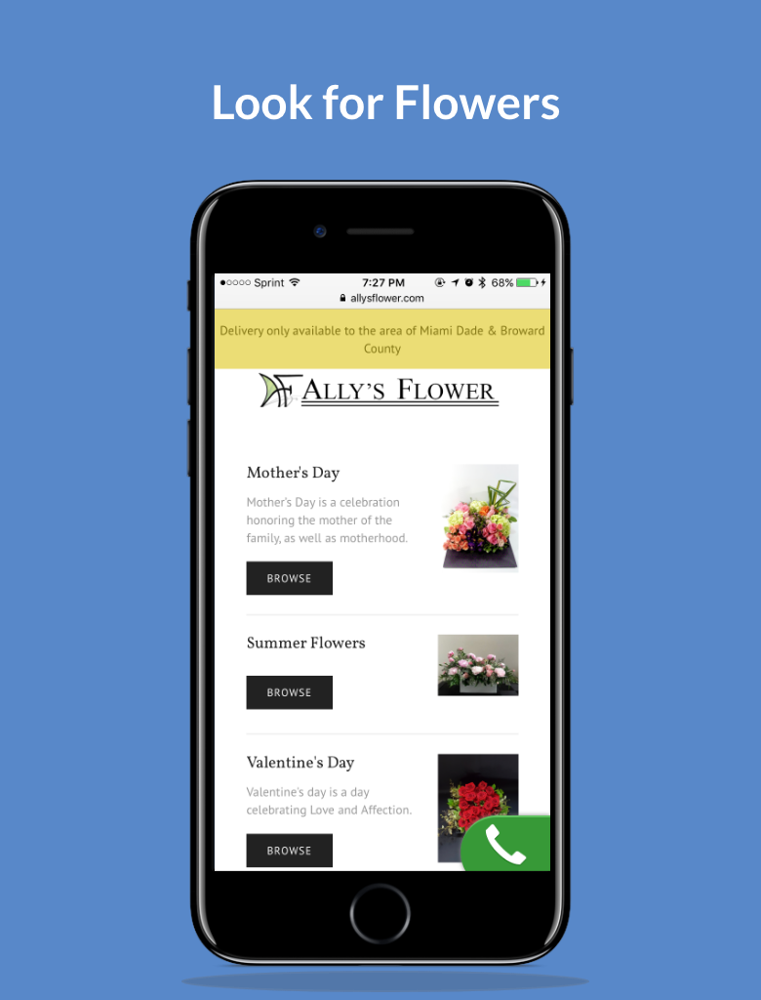 -->

### **`Stranded`**
`h233f7343sh2sd chores: brief changes`

**tech:** Vapor Framework

---

### **`YellowPepper Talks`**

 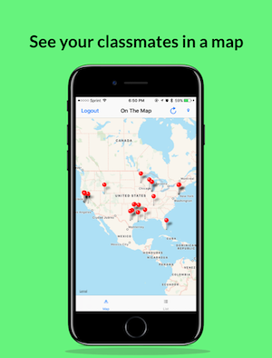 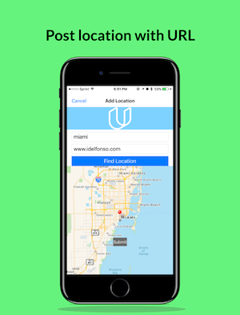

 Introduction to Firebase Database, IAM, and backend for the front end developers.

 I talked about how to start with Firebase, Realtime Database, and its rules. Also about Storage Database and it rules

 Along with it, I developed a small sample iOS project using Swift to send text and image nodes, how they are shown in the firebase console, and which methods I use to retrieve them in the client

**tech:** iOS: UIKit, Firebase

[GitHub](https://github.com/idelfonsog2/firebase_ios)

[Demo video](https://www.youtube.com/embed/tImGKXMNiMw)

---

### **`Hero World`**

Creating a test case for a new park for The Walt Disney company in order to track schedules and budgeting for the construction of all the projects.

Our dev team was able to implement a database using normalization, which helps identifies the identities inside the projects. We developed process of Table Creation, Views, Stored Procedures, Triggers. During the project we learned how an activity relates to a project, how a project can have many employees, and how a firm can own many employees. This is done using the concept of relational database.

**tech**: MySQL*

[GitHub](https://github.com/idelfonsog2/tumblr-app)

---

### **`Tubmlr Client`**

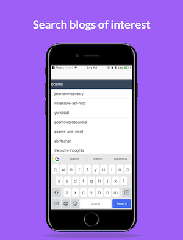 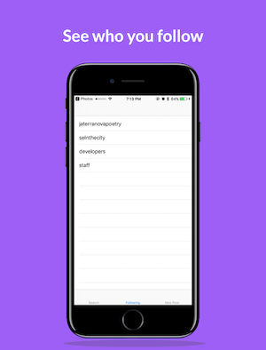 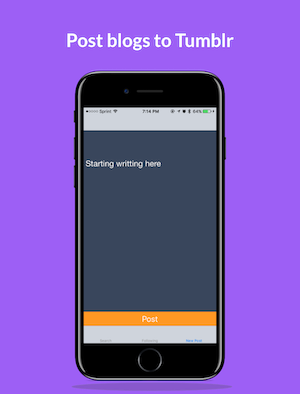

Created an iOS client in order to search blog users in Tumblr, follow users, and post text blogs.

**tech**: Tumblr API, UIKit

[GitHub](https://github.com/idelfonsog2/tumblr-app)

---
### **`On the Map`**

  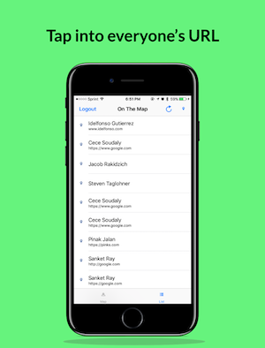

"On The Map" app allows users to share their location and a URL with their fellow students

**tech**: MapKit, Parse, Udacity API

[GitHub](https://github.com/idelfonsog2/udacity-on-the-map)

---

### **`Virtual Tourist`**

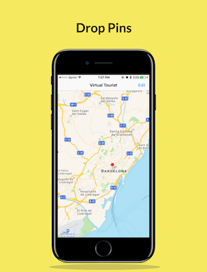 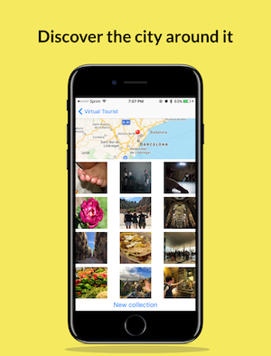

Wondering what kind of pictures have people taken in a particular place around the world?

Think about Virtual Tourist before Instagram search feature using Flicker

**tech** Flicker API, MapkKit, UIKit

[GitHub](https://www.idelfonso.com/)

Clients
----

### **`Ally's Flower`**

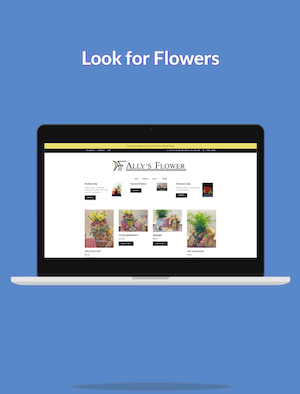 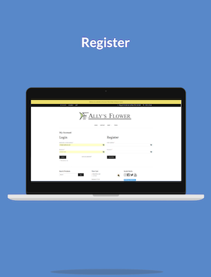 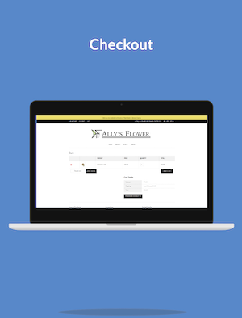

Using Wordpress and Woocommerce was able to create a simple solution for a small business.

The owner was so glad that she didn't need the help of a tech savvy person and that it could easily integrate with the power of Square (POS)

**tech**: Wordpress, CRM, POS

[www.allysflower.com](www.allysflower.com)

### **`Proendoscopy`**

Created an iOS app to manage a database of items. Pros the effectiveness of adding a new item to the device database and reducing the time up to 97.5%.

Proendoscopy is a local company in the city of Sunrise, it specializes in the service and repair of medical equipment, mainly endoscopes.

Our dev team was able to quickly identify the main problem in their workflow and inefficiency of procedures in the sales department

**tech**: iOS: Objective-C, CoreData, UIKit

# Experience

#### `Lead iOS Mobile Developer` [GrowIt!](http://growitmobile.com/) `Currently`

- Re-architecture the iOS application to follow the combination of Navigation Detail Views and Tab Bar Views using the Coordinator Pattern
- Implemented a Behavior Driven Development, which is basically is a an abstract layer for business stakeholders before developers get to it using a Test Driven Development pattern
- Re-wrote essential feature into Swift in combination with ModelView-ViewModel design pattern
- Trained an image recognition machine learning model based on a plant database to identify plant names
- Implemented a Not Safe For Work image recognition machine learning model to help the community team reduce the amount of flagging inapropiate content in the feed of the app
- Help develop several process that helps the development team building, testing and deploying front end and backend applications, some of them involve the use of Fastlane, JIRA + Github, Wiki's for development workflow, technical talks

#### `Technical Analyst iOS Mobile Developer` [Solstice Consulting](http://solstice.com/) `Sept 2017 - Feb 2018`

- Developing and maintaining client-side code through testing methodologies in agile environment
- Learning and working with user testing results to implement a great UI and business logic
- Participate in company forums and lectures, which explore new technologies.

#### `Intern  iOS Mobile Developer` [YellowPepper](http://www.yellowpepper.com) `Nov 2016 - May 2017`

- Worked with multiple iOS mobile banking projects developed with Objective-C and third-party frameworks
- Contributed to daily stand-ups with different teams around the world using the agile framework
- Addressed client’s concern regarding the app’s privacy policy in the App Store.
- Developed, released, and debugged native iOS mobile banking apps created with Objective-C for LATAM

#### `Instructor CoderDojo Dec 2014 - May 2016`

- Created stimulating lessons/games to an average of 20 students per session.
- Taught ongoing process and/or created new projects for beginners in a class of twenty students.
- Adapted sites like scratch.mit.edu and arduino.cc to motivate student’s creativity through technology.
- Coached public speaking at the end of each session so young ones can acquire the skills on how to structure their ideas.

#### `Programming Learning Assistant Florida International University Dec 2015 - May 2016`

- Taught on an ongoing process and/or create new projects for college students using Java programming language in a class of twenty students
- Explained Object Oriented Programming concepts during in and out sessions
- Used pair programming with students in order to practice and review material

#### `IT Intern Developer Martin Digital Group Jan 2014 - April 2015`

- Strengthen relationship with the clients by integrating my technical experience and expertise.
- Fashioned a blog to look like a fitness site for moms and a subscription program.
- Checked logs and malfunctioning errors to avoid conflict with purchasing process on the website.
- Maintained the network, installation, and use of new software and process.

# Education

- Startup Cohort @FIU Jan 2017 - April 2017
- B.S. Software Developer Florida International University Aug 2012 - May 2016
  - Minor: Social Media and E-marketing Analytics
- iOS Nanodegree Udacity Sep 2016 - Nov 2016

# *Contact Information*

📨 [idelfonsog2@gmai.com](mailto://idelfong2@gmail.com)

📞 [+1 954 513 9568](tel://+19545139568)

📱 [contact card](idelfonso.vcf)
