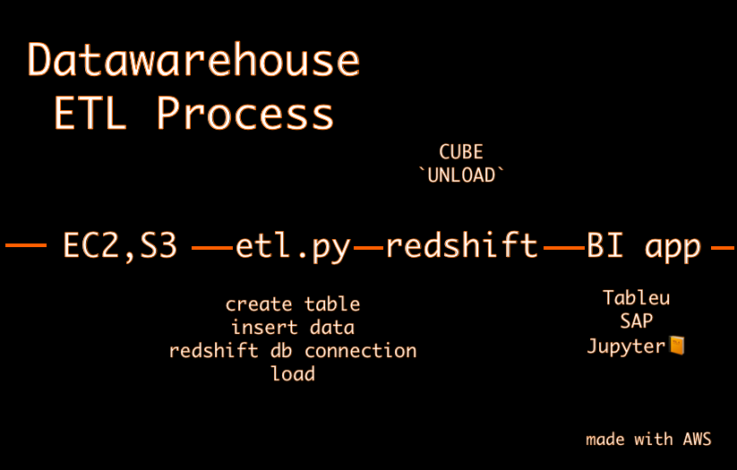
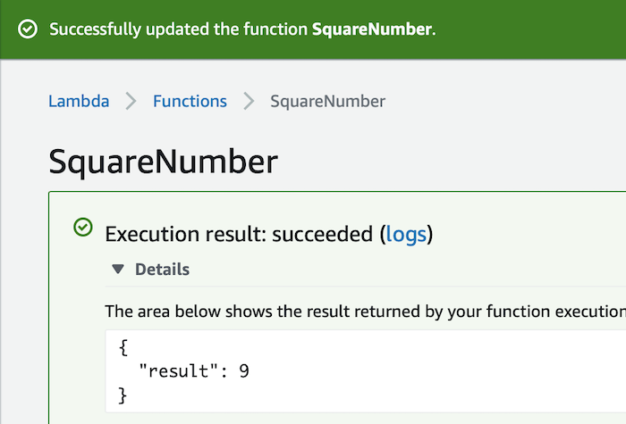

<meta property="og:title" content="Curiosity & Learning is the number one skill">
<meta property="og:image" content="https://idelfonsog2.github.io/img/circular-shot.png">

<p align="center">
	
</p>

    /// Idelfonso Gutierrez
    /// Dedicated Software Developer
***
#### Menú ☕️
- [Work Experience](#experience)
- Mobile Applications
  - [Stranded](#stranded) Dance with people at the airport
  - [mmMapp (sample)](#mmMapp) Find the best pathway around Miami, FL and forget about your car
  - [Read more...](#mobile-applications)
- Databases
  - [Data Scheduler](#data-scheduler) Use Airflow to backfill and schedule the load and analysis of raw data into Redshift datawarehouse
  - [Data Lake](#data-lakes---with-apache-spark--emr-cluster) Use Spark, Schema-On-Write, and EMR to create an ELT* process
  - [Data Warehouse](#data-ware-with-aws-redshift) Create an ETL process to insert OLAP cubes in amazon  redshift
  - [Big Data with Cassandra](#creating-an-etl-process-with-apache-cassandra) Use the partitioned row store for a distributed system. To analyze, clean and agreggate data.
  - [Enterprise data modeling](#data-modeling-with-postgresql) Normalize a dataset in order for online analytical processes
  - [Read more...](#databases)
- Miscellaneous
  - [Swift AWS Lambda (sample)](#lambdas-in-swift)
  - [Test Driven Development & Behavior Driven Development](#writing-bdd--tdd-in-my-current-projects) Use developer and business experience to drive the development of system. OSS contribution
  - [Read more...](#miscellaneous)
- [Clients](#clients) 
- [Education](#education)
- [Volunteer](#volunteer) 
- [Tech Stack](#tech-stack) 
- [Hobbies](#hobbies)
- [Contact](#contact-information)
  - 💬 [Chat..](https://wa.me/19545139568?text=Hi%20Idelfonso)
  - 📨 [idelfonsog2@gmail.com](mailto:idelfonsog2@gmail.com)
  - 💼 [Check Open Source Software...](https://github.com/idelfonsog2) 
  - 🐦 [Follow @idelfonsoGM](https://twitter.com/idelfonsoGM) 
  - 💼 [Download PDF](resume_us.pdf) 
  - 💾 [Save Contact as ...](idelfonso.vcf)
***

# Mobile Applications 

## Stranded

<!-- Follow: https://krausefx.com/ Pattern
  The Problem
  the Solution + images
  how it works + images
-->


#### _Background:_
_ORD_ 🛫 _MAD_ 🛬 _ETD 14:00 _

Waiting for your flight? How to start a conversation with someone? Maybe a dance... In order to dance you only need a smile and good energy
Math ➗ is international known. Music 🎼 is international heard. Dance, sculpture, literature, design, cuisine are different forms of expressions denoted as Arts which are internally perform.

> ## Social interaction is a human need

YES! It's something we get excited for and even further when we meet, travel or try something new. People can connect with each other despite the different languages, origins, cultures.

#### _The Solution:_
Stranded 🙂 brings people together at international places (airports) in different time zones! Allowing them to discover something new and exciting... and possibly a new friend.


tech: Combine, SwiftUI, APNS, database

---

## mmMapp

> ## The ability to keep learning is an invaluable skill

#### _Pitch:_
- Have you ever had too many events in the same day at different times and different locations?
- Were the events or appointments located close to each other?
- Do you always take into consideration how long will it take you to go from appointment A to appointment B?
- What about lunch? Do you have time to eat in the middle?
- Or where you live? Chicago? Great city transit by the way! 5x_ ⭐️ _Miami?_ ☹️ _Sorry its 1:40 min traffic along the I-95

**But most importantly!**
How happy... or how stress are you? ⛱ 🤯

#### _The Solution: Coming soon_

<!--  -->

---
### **`YellowPepper Talks`**

[](http://www.youtube.com/watch?v=tImGKXMNiMw)

Introduction to Firebase Database, IAM, and backend for the front end developers.

 I talked about how to start with Firebase, Realtime Database, and its rules. Also about Storage Database and it rules

 Along with it, I developed a small sample iOS project using Swift to send text and image nodes, how they are shown in the firebase console, and which methods I use to retrieve them in the client

**tech:** Swift, UIKit, AutoLayout, Firebase Realtime DB

[GitHub](https://github.com/idelfonsog2/firebase_ios)

<!-- [Demo video](https://www.youtube.com/embed/tImGKXMNiMw) -->

---

### **`Tubmlr Client`**

  

Created an iOS client in order to search blog users in Tumblr, follow users, and post text blogs.

**tech**: Tumblr API, UIKit

[GitHub](https://github.com/idelfonsog2/tumblr-app)

---
### **`On the Map`**

  

"On The Map" app allows users to share their location and a URL with their fellow students

**tech**: MapKit, Parse, Udacity API

[GitHub](https://github.com/idelfonsog2/udacity-on-the-map)

---

### **`Virtual Tourist`**

 

Wondering what kind of pictures have people taken in a particular place around the world?

Think about Virtual Tourist before Instagram search feature using Flicker

**tech** Flicker API, MapkKit, UIKit

[GitHub](https://www.idelfonso.com/)

---

[back to menu](#menu)

---

# Databases

## Data Scheduler

When data analysts and data scientists use data, they rely that is accurate and diverse enough in order to come up with these amazing models that help drive business decisions. Data comes from many places and from different times; a system could start collecting data tomorrow or it was already started 20 years ago; Imagine that 😅

#### Music data analyzer scheduler 

This project showcases how to design and schedule a series of jobs/steps using [Apache Airflow](https://airflow.apache.org/) with the following purposes
- Backfill data
- Build a dimensional data model using python
- load data from AWS S3 bucket to AWS Redshift Datawarehouse
- run quality checks on the data
- Use or create custom operators and available hooks to create reusable code


[Github](https://github.com/idelfonsog2/data-scheduler-airflow)

**tech:** AWS Redshift, Python, Apache Airflow, Docker
## Data Lakes 🚤  with Apache Spark + EMR Cluster

You can take a trip to a polluted lake or clean lake and how the water looks, taste, or where it comes from matters.

Data lakes is a new analogy to what Data Warehouse was till not too long ago. We are still using the same hardware for Data lakes, but with new tools which makes possible to cover more ground. In my previous project [STAR vs 3NF 🥊 SCHEMA](#STAR-vs-3NF-🥊-SCHEMA) I prepared the data to be ready for use by BI applications with the **OLAP cubes**. It's a structure that has been validated and vetted through several implementations and successful cases. When I learned about **Data lakes**: the tools, the language, Serverless (Python, learning Scala) I felt that I save a bit of automation by looking into it. Not to get me wrong, like any other technology it's flexible, there are pros and cons, budget, analysis of your workload, and team work.

> # Data is the new oil 🛢 🤑 and everybody knows it but not really

As I mention, automation, but not really. Instead of creating tables and doing the ETL dance, lets do the **ELT** 💃 dance. In which, we would infer the schema of "table" by setting the following:

```python
df = spark.read.csv('s3a://.../file.csv', sep=';', inferSchema=True, header=True)
df.createTempView("log_data")
user_table = df.spark.sql("""
                        SELECT user_id as id', 'year(ts) as year
                        FROM log_data
                        """)
user_table.show(1)
user_table.write.parquet('users', partittionBy='year')
```

[Jupyter Notebook](resources/data_lake.md)

We will perform our transformation and have them save in **S3** for which our BI apps could connect to or we could attached to the **cluster**, but they are expensive 💰. S3 it's cheap and it doesnt get shutdown.

Another step is the **Schema-on-read** for this process to be possible, and if you catch that there is a lot of steps.

There is some learning that I'm exited to be touching in the near future: data analyst, ML, cloud dev, **data streaming**


[Github](https://github.com/idelfonsog2/spark-music-data-pipeline)

**tech:** AWS EMR (Spark+HDFS), Python, Notebooks

---

## Data Ware🏡 with AWS Redshift

> Why would we want to use re-create our table structures for Analytical Procedures?

It happens that performance is much better, we can do fewer joins and access the same information. We still would like to have our 3NF schema for application purposes. Besides re-creating our tables, these can be improve... by a lot more with the following!

- Non-Columnar Storage (AWS REDSHIFT)
- Distribution table Style (All, even, key), 
- Distribution Keys 🔑

In the first point, I'm talking about creating an ETL process to load this data, but of course there is some setup that needs to be done

> ### _There is an overcrossing between Infra DevOps 🛠 and Data Engineers 💾_

For this project I utilize AWS web services like `redshift`, `s3 storage buckets`, `user roles`, `policies`, and `cloud watch`

The idea is how can we prepare data to be use by _Business Intelligence_ applications like Tableu or even Jupyternotebook! 👍
In order to help the business see an overview of the data in a diagram of what important features of the product their customers might be using. Mainly, how can we improve the performance of these OLAP and OLTP transactions. For that, we use the combination of star schema tables, we build a strategy for a distributed data system, and do grouping for all the features thanks to REDSHIFT.




[Jupyter Notebook](resources/data_warehouse.md)

[Github](https://github.com/idelfonsog2/data_warehouse_with_aws_redshift.git)

**tech:** AWS services*, Python, Jupyter

---

## Creating an ETL process with Apache Cassandra

### _Handling BIG DATA and storage now a days is no just feasible, it's a must._

```python
import pandas
import cassandra
``` 

Losing customer it's not an option. Today in the world we have a ton of devices that are gathering and sending data. The benefit of using a document store database #NoSQL, is that developers don't need to maintain and/or adjust entities, migrations and changes on existing products. Companies and product moves in an agile environment, where requirements are constantly changing; NoSQL allows us to spin these requirements in a quick manner.

#### The Business Case 💼

The following application establishes the following case where we have deploy a music app and its collecting data which it's the store to a local text file. From that we known which songs does the user listens to and which membership they are on (at a higher level).

```swift
// "Some of the largest production deployments include Apple's, with over 75,000 nodes storing over 10 PB of data, Netflix (2,500 nodes, 420 TB, over 1 trillion requests per day), Chinese search engine Easou (270 nodes, 300 TB, over 800 million requests per day), and eBay (over 100 nodes, 250 TB)." https://cassandra.apache.org/
```
My job was to extract transform and load this data into the system where business teams could bring their requirements and collect solutions from the data.

[🔗 Jupyter Notebook ETL Process](notebooks/cassandra-etl-pipeline.html)


[Github](https://github.com/idelfonsog2/cassandra-etl-pipeline)

**tech:** Apache Cassandra, Python, Pandas

---
## Data Modeling with PostgreSQL

```python
cur.execute("DROP DATABASE IF EXISTS ...")
```

Executing the basic CRUD commands is nothing new when it comes to building a system. A well-thought system it's very agnostic, and concepts are transferable within different lower level products. Some of the most popular RDBMS involve PostgreSQL, OracleSQL, MySQL. But where does the data comes from? How often does the data changes? How many files do we have, and how often we get new ones? Can we blame IoT 🛰 devices? 
> To the infinity and beyond... - Buzz Lightyear 1995

In the following application are given directory paths of where the client-side system is storing data files based on a music application product. I analyzed the data, build its entities and form the basic link between them. The analytics team is particularly interested in understanding what songs users are listening to


[Github](https://github.com/idelfonsog2/pslq-data-modeling)

**tech:** PostgreSQL, Python, Pandas

---
### **`Hero World`**

Creating a test case for a new park for The Walt Disney Company in order to track schedules and budgeting for the construction of all the projects.

Our dev team was able to implement a database using normalization, which helps identifies the identities inside the projects. We developed a process of Table Creation, Views, Stored Procedures, Triggers. During the project we learned how the activity relates to a project, how a project can have many employees, and how a firm can own many employees. This is done using the concept of a relational database.

**tech**: MySQL*

[GitHub](https://github.com/idelfonsog2/HeroWorld-SQL)

---

[back to menu](#menu)

---

# Miscellaneous 

## Lambdas in Swift

Many iOS developers don't realize at the beginning that they are actually using a programming language with Functional Paradigm and Principles.
The Swift language became really popular thanks to iOS applications. Today, the language does not only help builds applications across an array of customer-facing hardware (iOS, WatchOS, iPadOS, CarPlay) but also enterprise-level and research level as of backend applications and machine learning models respectively. Most recently I saw a microcontroller dev kit for people to start building projects that exist with Raspberry Pi but with Swift and it's own IDE

> # "a prototype is worth a 1000 meetings"

Many people say: "well.... its just a Hello World program" or "it lacks the vote from an enterprise point of view" To them I must say there is not an official council who approves or disapproves what technology lives up to the standards. And newer technology aims to address the issues and lack of current technology, how far we can push it, it's only up to us; developers to run with it an see what we like.

Thank you [Fabbian Fett](https://twitter.com/fabianfett) for given us Swift AWS Lambda



[GitHub](https://github.com/idelfonsog2/swift-aws-lambda-function)

---

## Writing BDD + TDD in my current projects

- **Who writes TDD?** tricky question🤔😅. Best case, its the output of a conversation between: devs, product owners/managers, stakeholders, and quality assurance testers
- **What is TDD?**  write software that assumes your production software is already built and make it compile/pass.
- **Why use TDD?** In order to avoid introducing bugs as you are adding or changing behavior.
- **When?** Drill down what you want your users to achieve _as concepts_ first _**[capabilities]**_
- **Where?** TextEdit! 📑 honestly!
- **How to?** Gherkin + Cucumber...ish + XCTest take a look [Cucumberish - Ahmed-Ali](https://cucumber.io/docs/installation/ios/) 👈🏽👀

> # No method is more effective than a good example. - Ingvar Kamprad, IKEA Founder

####  The Problem
A developer could write the following below. But this is missing some context, and only developers _**could!**_ be able to understand what is the system is doing.

<!-- not java, swift -->
```swift
func testSystem_whenReset_isInStarted() {
 sut.setToInProgress()

 sut.restart()

 XCTAssertEqual(sut.state, .blank)
}

```

#### A different approach: Give me an example

```gherkin
Given the application is "in progress"
When a user "restarts" the application
Then the application will set to "default"
```

```swift
func Given("the application is [regex]") { state in
 sut.set(state)
}

func When("a user [regex] the application") { action in
 sut.perform(action)
}

func Then("the application will set to [regex]") { expected in
 XCTAssertEqual(expected, sut.state)
}

```

The result out of it is that developers can make a set of reusable tests and stakeholders, product owners, QA tester can expand the tests into every state of the system.

Developers only need to keep following their TDD approach.


---

## **`Display vCard`**


#### _The Problem:_

_Do you have a business card? it probably has a cool design_ 📇

_They are useful when you need to leave in a rush_

_There is an individual in the middle, or "man in the middle"_

_manual work is prompt to error_

#### _The Solution:_

- _Update your information properly, inside the contacts app_
- [Install Shorcut](https://www.icloud.com/shortcuts/18cf866696df49e69c4e64bbf4a16e7a) 🛠
- _Select your contact card inside the shortcut "add contacts" step, it will show "me" on the right-hand side of the list item_
- _Now everytime you have to leave in a rush have the person use the **built-in! camera app**_ 📲📷 _to scan your contact in one second_

_**Note:** also use "Share sheet" to send it using AirDrop, not too many users allow airdrop from everyone_

 

tech: Siri shortcut

---

[back to menu](#menu)

---

# Experience


### Enterprise Mobility Developer | [Ulta Beauty](https://www.ulta.com/) | Chicago, U.S. | Feb. 2020 - Present

 - Present


---


### iOS Software Developer | [GrowIt!](http://growitmobile.com/) | Chicago, U.S. | Feb. 2018 - Feb. 2020

- In order to increase **40 percent** of the user base for our third-party clients, I implemented **beacon
technology**, **relational database**, and **mapbopx** library, which helped the company finalize 3 more contracts
- Use the **mobile instrumentation tool** to increase the efficiency of compilation time from 5 minutes to 2 minutes
and a half. Additionally, this help catch **data race conditions** between **Swift and Objective-C**
- Implement **Behavior Driven Development**, which is a document base layer for stakeholders to help
understand the situation, requirements, actions and results for every new and legacy feature.
- Automate the unit testing suite, app production submission, and quality assurance builds using continuous
integration and continuous deployment pipeline along with **Fastlane**.
- Help the community team decrease the amount of time reviewing inappropriate content by implementing
an image **machine learning** model based on a plant database to identify things that are not plants.
- **Solo developer** in the project

### tools/frameworks/libraries:

- Fastlane, CircleCI, apple push notifications services, RealmDB, iBeacon, AutoLayout, Mapbox, ReactiveCocoa/Swift 🛠

Tags: horticulture

---


### Technical Analyst iOS Mobile Developer | [Solstice Consulting](http://solstice.com/) | Chicago, U.S. | Sept 2017 - Feb 2018

- Developing and maintaining ongoing project using unit testing frameworks, **AWS APIs** and **Protobuf**
- Development of features between Internet of Things device and iPad App
- Deliver a presentation about machine learning intro which helped implement **image recognition** on a robot

### tools/frameworks/libraries:
- Jenkins, MongoDB, WebSockets, AutoLayout, Protobuf, ReactiveCocoa/Swift 🛠

tags: agriculture

---


### Intern  iOS Mobile Developer | [YellowPepper](http://www.yellowpepper.com) | Miami, U.S. | Nov 2016 - May 2017

- Worked with multiple iOS **mobile banking apps** developed with Objective-C and third-party frameworks.
- Worked with an off-site team and product owner (different time zones) in order to address patch fixes.
- Addressed client’s concern regarding the app’s privacy policy in order to submit to App Store.

### tools/frameworks/libraries:

- PCI APIs, Jenkins, AutoLayout, Objective-C, Alamofire 🛠

tags: financial technology

---

### IT Intern Developer | [Martin Digital Group](https://www.martindigitalgroup.com/) | Miami, U.S. | Jan 2014 - April 2015`

- Strengthen relationships with the clients by integrating my technical experience and expertise.
- Fashioned a blog to look like a fitness site for moms and a subscription program.
- Checked logs and malfunctioning errors to avoid conflict with a purchasing process on the website.
- Maintained the network, installation, and use of new software and process.

Tags: online marketing

### Java II Learning Assistant | [Florida International University CIS Department](https://www.cis.fiu.edu/) | Miami, U.S. | Dec 2015 - May 2016

- Taught on an ongoing process and/or create new projects for college students using Java programming language in a class of twenty students
- Explained Object Oriented Programming concepts during in and out sessions
- Used pair programming with students in order to practice and review material

tags: education

---

# Clients

### **Ally's Flower**

  

Using WordPress and Woocommerce was able to create a simple solution for a small business.

The owner was so glad that she didn't need the help of a tech-savvy person and that it could easily integrate with the power of Square (POS)


**tech**: WordPress, CRM, POS

[www.allysflower.com](www.allysflower.com)

--- 

### **Proendoscopy**

Created an iOS application to manage the items in inventory for a medical equipment repair company.

- Keep up to date items with the sold, in progress, not started labels
- Keep a record of prices for each item
- Group items by brand, category, price range

Proendoscopy is a local company in the city of Sunrise, it specializes in the service and repair of medical equipment, mainly endoscopes.

Our dev team was able to quickly identify the main problem in their workflow and inefficiency of procedures in the sales department.

**tech**: iOS: Objective-C, CoreData, UIKit

---

# Education

- B.S. Software Developer Florida International University Aug 2012 - May 2016
  - Minor: Social Media and E-marketing Analytics
- Startup Cohort @FIU Jan 2017 - April 2017
- iOS Nanodegree Udacity Sep 2016 - Nov 2016
- Data Engineer Nanodegree Udacity - in progress
  - RDBMS Design and SQL
  - Python scripting
  - Data Warehouse Architecture
  - Dimensional Modeling and OLAP cubes
  - Familiarity with AWS services
  - Spark & HDFS

# Volunteer 

### Instructor | [CoderDojo](https://coderdojo.com/) | Miami, U.S. | Dec 2014 - May 2016

- Created stimulating lessons/games to an average of 20 students per session.
- Taught ongoing process and/or created new projects for beginners in a class of twenty students.
- Adapted sites like scratch.mit.edu and arduino.cc to motivate student’s creativity through technology.
- Coached public speaking at the end of each session so young ones can acquire the skills on how to structure their ideas.

tags: education

# Tech stack

`objective-c` `swift` `swift packages` `XCTest` `XCUITest` `TDD` `BDD` `BFF` `iOS` `watchOS` `SwiftUI` `MVVM` `MV` `monolith` `microservices` `core-data` `python` `sql` `Combine` `pandas` `apache-cassandra` `apache-spark` `aws-emr` `aws-redshift` `aws-s3` `vapor-swift` `jupyter-notebook` 

- Several years of professional experience in software development.
- Implement enterprise business solutions.
- Implement IoT iPad OS application.
- Implement ML Model solution.
- Implement Social Media based application.
- Implement Location-based mobile applications.
- Implement realtime mobile application databases.
- Implement notification system and data exchange mobile applications
- Implement CI/CD software pipelines.
- Implement software architecture patterns and best practices.
- Implement web services communication.
- Beginner experience with AWS services: AWS EMR, REDSHIFT, EC2, IAM, Lambda
- Beginner experience with Apache Spark, Apache Cassandra
- Experience working with variations of teams from solo developer to technical leadership coordination across tech-stack
- Keeping up to date with new technologies (and my community ❤️iOS)
- MobDevOps, learning cloud developer operations with AWS web services
- Mentoring (also read: [volunteer](#volunteer))
- Ensuring safe test-driven and behavior-driven development
- Advocate for the technical vision

# Hobbies

## Learning
- [Behavior Driven Development in Action](https://www.amazon.com/BDD-Action-Behavior-driven-development-lifecycle/dp/161729165X/ref=sr_1_1?crid=1QMU5POSX4VUP&dchild=1&keywords=behavior+driven+development&qid=1601994363&s=books&sprefix=behavior+Driven+Deve%2Cstripbooks%2C167&sr=1-1)
- Functional Programming in Swift -> Goal: Scala
- [Working With Legacy Code](https://www.amazon.com/Working-Effectively-Legacy-Michael-Feathers/dp/0131177052)
- [Designing Data-Intensive Applications](https://www.amazon.com/Designing-Data-Intensive-Applications-Reliable-Maintainable/dp/1449373321/ref=sr_1_1?crid=393J1ET1HBZB8&dchild=1&keywords=designing+data+intensive+applications&qid=1601994325&s=books&sprefix=designing+data+i%2Cstripbooks%2C162&sr=1-1)
- [Server-Side Swift](https://www.google.com/search?client=safari&rls=en&q=vapor.code&ie=UTF-8&oe=UTF-8)
- [A metabolic approach to cancer 📚](https://www.amazon.com/Metabolic-Approach-Cancer-Integrating-Bio-Individualized/dp/1603586865/ref=sr_1_2?crid=K25WDL26D9QF&dchild=1&keywords=a+metabolic+approach+to+cancer&qid=1601994411&sprefix=a+metabolic%2Cstripbooks%2C158&sr=8-2)
- [Geopolitics](https://www.amazon.com/Next-100-Years-Forecast-Century-ebook/dp/B001NLL946/ref=sr_1_1?crid=2DE719JVUJ0NJ&dchild=1&keywords=the+next+100+years+george+friedman&qid=1601994579&sprefix=the+next+100%2Caps%2C160&sr=8-1)
- Urban planning

<blockquote class="twitter-tweet"><p lang="et" dir="ltr">que bueno 🤣🙌🏾 Actitud | Victor Küppers | TEDxAndorralaVella <a href="https://t.co/orerUgfhpo">https://t.co/orerUgfhpo</a> via <a href="https://twitter.com/YouTube?ref_src=twsrc%5Etfw">@YouTube</a></p>&mdash; Idelfonso (@idelfonsoGM) <a href="https://twitter.com/idelfonsoGM/status/1197903846305140738?ref_src=twsrc%5Etfw">November 22, 2019</a></blockquote> <script async src="https://platform.twitter.com/widgets.js" charset="utf-8"></script>

## Tango
<iframe src="https://open.spotify.com/embed/track/2AQMjBwUTYCjMqGpcXBayR" height="80" frameborder="0" allowtransparency="true" allow="encrypted-media"></iframe>

Photograph by Charapin 🙌🏾


